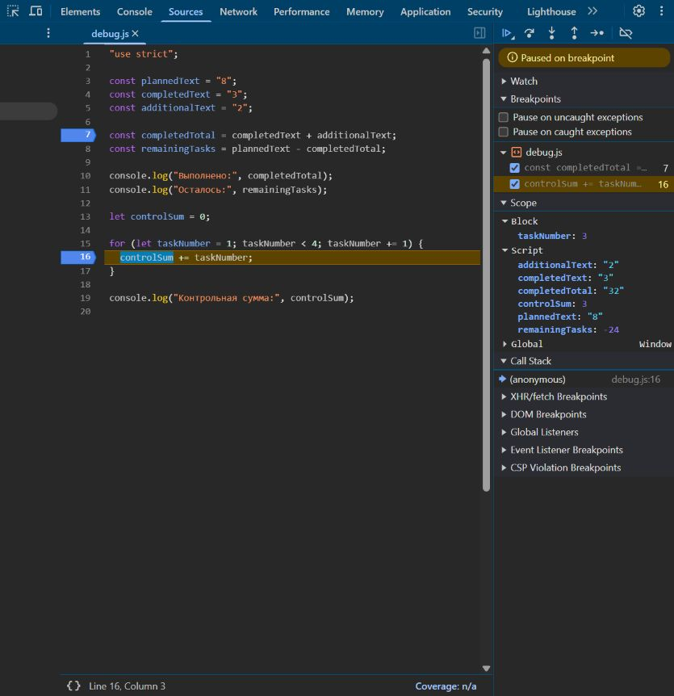

# Практическая работа № 1

Тема: подготовка окружения и первые программы на JavaScript.

Работа выполнена по [заданию преподавателя](https://github.com/adyshkins/TIP-JS/blob/main/practices/practice-01/PR01_JavaScript.md). [Папка для сдачи](https://github.com/Zepo4ka/tip-js-practices/tree/main/practice-01).

## 1. Автор и вариант

- Автор: Гаврилов Даниил.
- Группа: ЭФБО-05-25.
- Номер в журнале: `N = 5`.
- Вариант: `((5 - 1) % 8) + 1 = 5`.
- Основные входы: `totalTasks = 7`, `completedTasks = 2`, `dailyLimit = 2`.

В `progress.js` и `plan.js` оставлены данные варианта 5. Общие проверки выполнены отдельно; вариант их не заменяет.

## 2. Окружение

| Компонент | Версия или окружение |
|---|---|
| ОС | Windows 11 Домашняя для одного языка |
| Node.js | v24.11.1 |
| npm | 11.6.2 |
| Git | 2.55.0.windows.5 |
| Браузер | Встроенный браузер Codex для проверки пяти файлов; Chromium 148.0.7778.96 для выполнения программы в отладчике |

Проверка версий в терминале:

```powershell
node --version
npm.cmd --version
git --version
```

В PowerShell вызов `npm.cmd` позволяет проверить npm без изменения политики запуска сценариев.

## 3. Запуск

Команды выполняются из корня репозитория `tip-js-practices`:

```powershell
node practice-01/js/hello.js
node practice-01/js/types.js
node practice-01/js/progress.js
node practice-01/js/plan.js
node practice-01/js/debug.js
```

Все пять файлов проверены в Node.js. Входы задаются константами в начале файлов. Для другой проверки можно изменить их значения, повторить запуск и затем вернуть свой вариант.

Порядок запуска в браузере:

1. Открыть `practice-01/index.html`.
2. Открыть инструменты разработчика и вкладку Console.
3. Для следующего задания заменить `src` единственного элемента `script` на нужный файл, например `./js/types.js`.
4. Сохранить HTML, перезагрузить страницу и посмотреть Console.
5. После проверок вернуть `./js/hello.js`.

Подключается только один файл, чтобы одноимённые переменные разных заданий не объявлялись повторно. Для этой работы достаточно локального HTML: модулей и сетевых запросов нет.

Все пять файлов повторно запущены во встроенном браузере Codex справа от чата. Для проверки использовался локальный HTTP-сервер, отдающий только учебные файлы. Каждый запуск подключал один файл. Сообщений об ошибках выполнения скриптов не получено.

## 4. Задание 1. Один файл в двух средах

Файл `hello.js` начинается со строгого режима и выводит данные автора. Фактический вывод Node.js:

```text
Студент: Гаврилов Даниил
Группа: ЭФБО-05-25
Практическая работа: 1
JavaScript успешно запущен
Тип document: undefined
```

В Node.js сообщения появились в терминале. В браузере вывод программы находится в Console инструментов разработчика. HTML-страница содержит заголовок и пояснение.

Ожидаемая последняя строка в браузере — `Тип document: object`. Браузер предоставляет объект `document` для работы с HTML. В обычном запуске Node.js такого объекта нет, поэтому `typeof document` возвращает `"undefined"`. В данном случае применение `typeof` к отсутствующему имени не вызывает исключение.

Фактический вывод браузера совпал с выводом Node.js, кроме последней строки: `Тип document: object`.

## 5. Задание 2. Типы и преобразования

Прогнозы записаны перед повторной проверкой при завершении работы. Файл `types.js` уже запускался в первоначальной попытке; эта таблица не выдаётся за исторический прогноз студента до самого первого запуска. Фактические значения и типы получены при повторной проверке в Node.js.

| Выражение | Прогноз перед повторной проверкой | Фактическое значение | Тип результата | Причина |
|---|---|---|---|---|
| `"8" + 2` | `"82"`, `string` | `"82"` | `string` | Число преобразуется в строку, затем строки объединяются. |
| `"8" - 2` | `6`, `number` | `6` | `number` | Вычитание преобразует строку с числом в число. |
| `Number("8") + 2` | `10`, `number` | `10` | `number` | Явное преобразование делает оба операнда числами. |
| `"12" > "3"` | `false`, `boolean` | `false` | `boolean` | Строки сравниваются по символам; первый символ `"1"` меньше `"3"`. |
| `12 === "12"` | `false`, `boolean` | `false` | `boolean` | Строгое равенство не преобразует разные типы. |
| `Number("")` | `0`, `number` | `0` | `number` | Пустая строка при этом преобразовании становится нулём. |
| `Number("text")` | `NaN`, `number` | `NaN` | `number` | Строка не содержит числа; `NaN` относится к числовому типу. |
| `Boolean("false")` | `true`, `boolean` | `true` | `boolean` | Любая непустая строка истинна, независимо от написанного в ней слова. |
| `typeof null` | `"object"`, `string` | `"object"` | `string` | Историческая особенность `typeof`; результат самого оператора — строка. |
| `typeof NaN` | `"number"`, `string` | `"number"` | `string` | `NaN` — числовое значение, а `typeof` возвращает строку с названием типа. |

Все десять выражений проверены. В последних двух строках отдельно показаны значение `typeof ...` и тип полученной строки.

Все десять фактических значений и типов в браузере совпали с таблицей и запуском Node.js.

## 6. Задания 3 и 4. Расчёты и проверки

Проверки выполнены в Node.js на копии прочитанного исходного текста с заменой входных констант для каждого случая. Для запуска применена изолированная среда `node:vm`, для сравнения вывода — `node:assert/strict`. Файлы в репозитории сохранили вариант 5. Это способ повторной проверки, а не требование к обязательному решению.

При некорректном вводе проверено ровно одно сообщение с началом `Ошибка:`, без обычной сводки или запуска цикла.

Обозначения точных фактических сообщений в таблицах:

- **К**: `Ошибка: количества задач должны быть целыми числами от 0 до 1000, выполнено не больше общего количества.`
- **Н**: `Ошибка: дневная норма должна быть целым числом от 1 до 1000.`

### 6.1. Сводка выполнения задач

Количество задач проверяется на конечность, целочисленность и границы. Строки автоматически не преобразуются. Для нулевого общего количества есть отдельное сообщение без деления. Статус зависит от исходных количеств; процент отображается с одним знаком после десятичной точки.

| Проверка | Входы `totalTasks; completedTasks` | Ожидаемый результат | Фактический результат Node.js | Итог |
|---|---|---|---|---|
| Обычный случай | `12; 5` | Осталось 7; 41.7%; «В работе» | Всего 12; выполнено 5; осталось 7; прогресс 41.7%; статус «В работе» | Пройдено |
| Пустой список | `0; 0` | Сообщение без процента | `Задач пока нет` | Пройдено |
| Ничего не выполнено | `5; 0` | Осталось 5; 0.0%; «Не начато» | Всего 5; выполнено 0; осталось 5; прогресс 0.0%; статус «Не начато» | Пройдено |
| Всё выполнено | `5; 5` | Осталось 0; 100.0%; «Завершено» | Всего 5; выполнено 5; осталось 0; прогресс 100.0%; статус «Завершено» | Пройдено |
| Выполнено больше общего | `5; 6` | Ошибка без сводки | К | Пройдено |
| Отрицательное количество | `-1; 0` | Ошибка без сводки | К | Пройдено |
| Дробное количество | `5; 2.5` | Ошибка без сводки | К | Пройдено |
| Строка вместо числа | `"5"; 2` | Ошибка без преобразования строки | К | Пройдено |
| Превышена граница | `1001; 0` | Ошибка без сводки | К | Пройдено |
| Недопустимое число | `NaN; 0` | Ошибка без сводки | К | Пройдено |
| Свой вариант 5 | `7; 2` | Осталось 5; 28.6%; «В работе» | Всего 7; выполнено 2; осталось 5; прогресс 28.6%; статус «В работе» | Пройдено |

Фактический вывод для варианта 5:

```text
Всего задач: 7
Выполнено: 2
Осталось: 5
Прогресс: 28.6%
Статус: В работе
```

Дополнительно проверены восемь наборов: `(5, NaN)`, `(5, Infinity)`, `(5, null)`, `(5, undefined)`, `(5, -1)`, `(Infinity, 0)`, `(null, 0)`, `(1000, 1001)`. Во всех восьми случаях фактически получено только сообщение К; все проверки пройдены.

### 6.2. План по дням

Сначала проверяются количества задач, затем дневная норма. Норма проверяется даже при отсутствии оставшихся задач. Цикл `while` каждый день уменьшает остаток на меньшее из лимита и текущего остатка. Последняя итерация не выполняет лишние задачи, остаток не становится отрицательным.

В колонке факта запись `день: выполнено/осталось` описывает соответствующую строку консоли.

| Проверка | Входы `totalTasks; completedTasks; dailyLimit` | Ожидаемый результат | Фактический результат Node.js | Итог |
|---|---|---|---|---|
| Обычный случай | `12; 5; 3` | 3 дня; в последний день 1 задача | Осталось 7; день 1: 3/4; день 2: 3/1; день 3: 1/0; потребуется дней: 3 | Пройдено |
| Остаток кратен норме | `10; 4; 3` | 2 дня по 3 задачи | Осталось 6; день 1: 3/3; день 2: 3/0; потребуется дней: 2 | Пройдено |
| Лимит больше остатка | `5; 3; 10` | 1 день, только 2 задачи | Осталось 2; день 1: 2/0; потребуется дней: 1 | Пройдено |
| Всё выполнено | `5; 5; 2` | Цикл не выполняется; 0 дней | `Все задачи уже выполнены`; `Потребуется дней: 0` | Пройдено |
| Нет задач | `0; 0; 2` | Цикл не выполняется; 0 дней | `Все задачи уже выполнены`; `Потребуется дней: 0` | Пройдено |
| Нулевая норма | `5; 2; 0` | Ошибка; цикл не запускается | Н | Пройдено |
| Дробная норма | `5; 2; 1.5` | Ошибка; цикл не запускается | Н | Пройдено |
| Выполнено больше общего | `5; 6; 2` | Ошибка количеств; цикл не запускается | К | Пройдено |
| Норма задана строкой | `5; 2; "2"` | Ошибка без преобразования строки | Н | Пройдено |
| Норма выше границы | `5; 2; 1001` | Ошибка; цикл не запускается | Н | Пройдено |
| Свой вариант 5 | `7; 2; 2` | 3 дня: по 2, 2 и 1 задаче | Осталось 5; день 1: 2/3; день 2: 2/1; день 3: 1/0; потребуется дней: 3 | Пройдено |

Фактический вывод для варианта 5:

```text
Осталось задач: 5
День 1: выполнено 2, осталось 3
День 2: выполнено 2, осталось 1
День 3: выполнено 1, осталось 0
Потребуется дней: 3
```

Семь дополнительных проверок:

- `(0, 0, 0)`, `(5, 5, 0)`, `(0, 0, NaN)`: только сообщение Н, несмотря на отсутствие оставшихся задач.
- `(5, 2, Infinity)`, `(5, 2, null)`, `(5, 2, undefined)`: только сообщение Н.
- `(-1, 0, 2)`: только сообщение К.

Все дополнительные проверки пройдены. Всего проверено **37 наборов**: 19 для `progress.js` и 18 для `plan.js`. В счёт включены обязательные случаи, вариант 5 и перечисленные дополнительные проверки.

Браузерный запуск варианта 5 подтвердил те же результаты: в сводке осталось 5 задач, прогресс 28.6%, статус «В работе»; в плане три дня с выполнением 2, 2 и 1 задачи, остатки 3, 1 и 0.

## 7. Задание 5. Отладка

Исходная программа запущена отдельно до исправления. Она завершилась без исключения, но дала неверные результаты:

```text
Выполнено: 32
Осталось: -24
Контрольная сумма: 6
```

После исправления фактический вывод Node.js:

```text
Выполнено: 5
Осталось: 3
Контрольная сумма: 10
```

| Ошибка | Что наблюдалось | Причина | Исправление | Фактический результат после исправления |
|---|---|---|---|---|
| Обработка количества задач | `completedTotal = "32"`, затем `remainingTasks = -24` | Строки `"3"` и `"2"` объединялись оператором `+`. Вычитание `"8" - "32"` преобразовывало строки в числа. | Преобразовать исходные строковые количества через `Number()` перед вычислениями. | Выполнено 5; осталось 3. |
| Граница цикла | `controlSum = 6` | Условие `taskNumber < 4` включало только номера 1, 2 и 3. | Использовать `taskNumber <= 4`, включив номер 4. | Контрольная сумма 10. |

Для исследования исходной ошибки в Sources поставлены точки останова перед вычислением суммы (строка 7) и внутри цикла (строка 16). После перезагрузки в Scope видны строковые `completedText = "3"` и `additionalText = "2"`. После Step over программа остановилась на строке 8: `completedTotal = "32"`, строкового типа. Следующий шаг подтвердил `remainingTasks = -24`. Наблюдения относятся к исходной версии, а не к исправленному файлу для сдачи.

При последовательных остановках внутри цикла наблюдались пары `taskNumber / controlSum`: `1 / 0`, `2 / 1`, `3 / 3`. После выполнения третьего сложения сумма стала `6`; четвёртой итерации не было. Снимок ниже получен в отладчике, открытом во встроенном браузере справа от чата: программа остановлена на строке 16 перед третьим сложением, видны номер задачи, контрольная сумма и ошибочные значения количеств. Перед завершением проверки обе точки останова отключены, программа продолжила выполнение.



Повторение отладки: подключить исследуемую версию `debug.js`, открыть Sources, поставить точку останова на вычислении суммы, перезагрузить страницу, исследовать значения и типы, выполнить Step over. Для цикла нужно остановиться внутри тела и проследить номера итераций. При обычной демонстрации активные точки останова следует убрать.

В сдаваемом `debug.js` сохранена исправленная программа с вычислениями, а не заранее записанными ответами. Исходный фактический вывод и обе причины ошибок сохранены в этом отчёте.

Исправленный `debug.js` проверен во встроенном браузере Codex: `Выполнено: 5`, `Осталось: 3`, `Контрольная сумма: 10`. Результат совпал с Node.js.

## 8. Вывод

В работе применены строгий режим, переменные, явное преобразование типов, условия и циклы. Реализованы сводка выполнения и пошаговый план для варианта 5. Проверки показали правильную обработку обычных, нулевых, граничных и некорректных входных данных.

Наиболее показательная ошибка — сложение строковых количеств. Программа могла завершиться без исключения и вывести `32` вместо суммы `5`. Проверка значения вместе с типом объяснила причину, а `Number()` исправил расчёт. Ошибка границы цикла показала, почему нужно проверять включение последнего номера.

Дополнительное расширение из раздела 8 задания не реализовано. Дополнительные проверки некорректных входов относятся к проверке обязательных решений.
