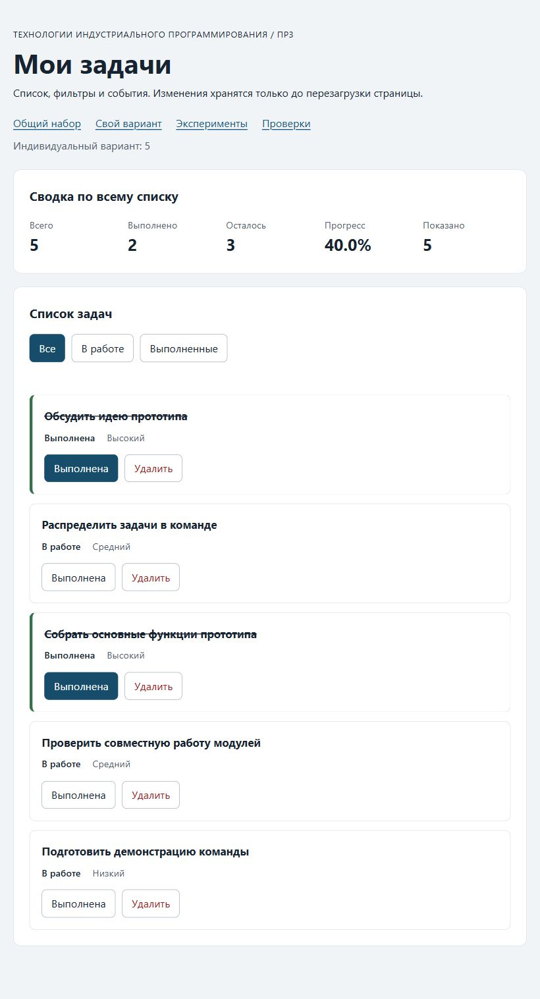

# Практическая работа № 3. Работа с DOM и событиями

## Данные работы

| Поле | Значение |
|---|---|
| Имя | Гаврилов Даниил |
| Группа | ЭФБО-05-25 |
| Номер в журнале / вариант из ПР2 | 5 / `((5 - 1) % 8) + 1 = 5` |
| Node.js / npm | `v24.11.1` / `11.6.2` |
| Браузер | Встроенный браузер Codex для интерфейса; отдельная цель DevTools — Chromium `148.0.7778.96` |
| Операционная система | Windows 11, сборка `26200` |

## Запуск

Рабочая папка: `D:\vscode\vsc\MireaTechIndst\tip-js-practices\practice-03`.

```bash
npm run check:service
npm start
```

Фактически проверки сервиса запущены командой `npm.cmd run check:service` из указанной рабочей папки. Для запуска в PowerShell используется `npm.cmd start`.

Устанавливать зависимости через `npm install` не требуется. Для PowerShell при блокировке `npm.ps1` доступны `npm.cmd` и прямые команды `node`.

```text
http://127.0.0.1:5503/
http://127.0.0.1:5503/index.html?dataset=variant
http://127.0.0.1:5503/examples/dom-events.html
http://127.0.0.1:5503/checks.html
```

Остановка сервера: `Ctrl+C`. Если выбран другой порт, указать фактическую команду и адрес.

## Что перенесено из ПР2

`src/task-service.js` и `src/data.js` скопированы из собственной завершённой ПР2. Файлы ПР2 не менялись. Прикладной модуль содержит создание, поиск, выборку, сводку, добавление, изменение статуса, переименование и удаление задач; обращения к DOM в нём отсутствуют. Данные сохраняют общий контрольный набор и шесть задач варианта 5.

Копия сервиса внутри ПР3 повторно проверена: 35 сценариев пройдено, 0 ошибок. Официальные файлы `checks`, `examples`, `tools`, HTML, CSS и `package.json` сохранены из стартового комплекта.

## Эксперименты

| № | До запуска: прогноз | После запуска: результат | Объяснение |
|---:|---|---|---|
| 1. Отсутствующий элемент и коллекция | `querySelector` даст `null`; пустой `querySelectorAll` имеет длину 0 | В Console получены `null` и длина `0` | Элемент не найден; пустой `NodeList` существует, но в нём нет записей |
| 2. dataset и числовой id | До преобразования строка `"23"`, после `Number` число `23` | `dataset.taskId` — `"23"`, тип `string`; результат преобразования — `23` | Атрибуты `data-*` читаются строками; сервис работает с числовым идентификатором |
| 3. Статический NodeList | После двух добавлений сохранённая коллекция имеет длину 1, новый запрос — 3 | После двух нажатий `initialItems.length = 1`, новый `querySelectorAll("li").length = 3` | `NodeList` от `querySelectorAll` является снимком на момент запроса |
| 4. Строка с HTML-разметкой | Угловые скобки видны как текст; элемент `strong` не создан | Заголовок содержит `<strong>Это текст, а не HTML</strong>` буквально; вложенных `strong` — `0` | `textContent` не разбирает строку как HTML |
| 5. Распространение события | Захват контейнера `phase=1`, обработчик кнопки и всплытие контейнера `phase=3`; цель везде `lab-label` | При нажатии именно на `span#lab-label` получены записи: `1. phase=1; target=lab-label; currentTarget=lab-card`, `2. phase=3; target=lab-label; currentTarget=lab-button`, `3. phase=3; target=lab-label; currentTarget=lab-card` | `target` сохраняет вложенную цель, `currentTarget` меняется с обработчиком; кнопка — предок `span`, поэтому её обработчик вызывается при всплытии |

Прогнозы записаны до действий. Все пять экспериментов фактически выполнены на `examples/dom-events.html` во встроенном браузере Codex. Точка останова и значения события рассматриваются отдельно в разделе отладки.

## Организация кода

| Модуль | Ответственность |
|---|---|
| `data.js` | Неизменяемые исходные наборы и номер варианта; начальное состояние копируется в `main.js` |
| `task-service.js` | Прикладные операции ПР2 возвращают `ok`, новый массив либо понятную ошибку; сводка вычисляется `getTaskStats` |
| `task-selectors.js` | `getVisibleTasks` создаёт новый массив по статусу, сохраняет порядок и входные записи |
| `task-view.js` | Создаёт `li`, заголовки, статусы, приоритеты и кнопки через DOM; заменяет дочерние узлы списка; обновляет сводку и пустое состояние |
| `main.js` | Хранит полный `currentTasks` и `currentFilter`; один раз подписывает контейнеры; распознаёт кнопку через `closest`, проверяет `id`, вызывает сервис и обновляет представление |

Названия и сообщения назначаются через `textContent`. `renderApp` не назначает обработчики и не изменяет задачи. Фильтрация изменяет только видимость, а сводка всегда получает полный массив. После успешного изменения массив сохраняется из `result.tasks`, затем выполняется повторная отрисовка и восстановление фокуса. При отказе данные остаются прежними.

## Общий сценарий

Ожидания находятся в разделе 6.5 методички и записаны до действий. Во встроенном браузере фактически получены следующие результаты:

| Шаг | Действие | Видимые id | Всего | Выполнено | Осталось | Прогресс | Показано | Сообщение | Совпало с ожиданием |
|---:|---|---|---:|---:|---:|---|---:|---|---|
| 0 | Перезагрузка, «Все» | `[1, 4, 7, 10]` | 4 | 2 | 2 | `50.0%` | 4 | Нет | Да |
| 1 | Выбрать «В работе» | `[4, 7]` | 4 | 2 | 2 | `50.0%` | 2 | Нет | Да |
| 2 | Отметить выполненной `4` | `[7]` | 4 | 3 | 1 | `75.0%` | 1 | Нет | Да |
| 3 | Выбрать «Все» | `[1, 4, 7, 10]` | 4 | 3 | 1 | `75.0%` | 4 | Нет | Да |
| 4 | Удалить `7` | `[1, 4, 10]` | 3 | 3 | 0 | `100.0%` | 3 | Нет | Да |
| 5 | Выбрать «В работе» | `[]` | 3 | 3 | 0 | `100.0%` | 0 | `Нет задач по выбранному фильтру.` | Да |
| 6 | Выбрать «Все», переключить `1` клавишей Enter | `[1, 4, 10]` | 3 | 2 | 1 | `66.7%` | 3 | Нет | Да |
| 7 | Удалить `1`, `4`, `10` | `[]` | 0 | 0 | 0 | `0.0%` | 0 | `Список задач пуст.` | Да |

После перезагрузки вернулись `[1, 4, 7, 10]`, сводка `4/2/2/50.0%`, показано 4; сообщения отсутствуют. Таким образом, ПР3 восстанавливает исходные данные при новой загрузке, поскольку сохранение здесь не реализуется.

## Индивидуальный вариант

Вариант 5 — «Разработка командного прототипа». Исходные данные перенесены из ПР2 без изменения:

| id | Название | Изначально выполнена | Приоритет |
|---:|---|---|---|
| 11 | Обсудить идею прототипа | Да | Высокий |
| 23 | Распределить задачи в команде | Да | Средний |
| 37 | Подготовить макет экранов | Да | Низкий |
| 41 | Собрать основные функции прототипа | Да | Высокий |
| 58 | Проверить совместную работу модулей | Нет | Средний |
| 64 | Подготовить демонстрацию команды | Нет | Низкий |

Контрольное ожидание после переключения `23` и удаления `37`: пять задач, две выполнены, три в работе, `40.0%`, порядок `[11, 23, 41, 58, 64]`. При запуске во встроенном браузере наблюдались:

| Этап | Всего | Выполнено | Осталось | Прогресс | Показано | Видимые id |
|---|---:|---:|---:|---|---:|---|
| До действий, «Все» | 6 | 4 | 2 | `66.7%` | 6 | `[11, 23, 37, 41, 58, 64]` |
| До действий, «В работе» | 6 | 4 | 2 | `66.7%` | 2 | `[58, 64]` |
| До действий, «Выполненные» | 6 | 4 | 2 | `66.7%` | 4 | `[11, 23, 37, 41]` |
| Вернуться в «Все», переключить `23`, удалить `37` | 5 | 2 | 3 | `40.0%` | 5 | `[11, 23, 41, 58, 64]` |
| После действий, «В работе» | 5 | 2 | 3 | `40.0%` | 3 | `[23, 58, 64]` |
| После действий, «Выполненные» | 5 | 2 | 3 | `40.0%` | 2 | `[11, 41]` |

Результат совпал с контрольным ожиданием. Названия и приоритеты остальных записей сохранились; сообщения ошибок не появились.

## Протокол проверки сервиса

Фактический вывод `npm.cmd run check:service`:

```text
> tip-js-practice-03@1.0.0 check:service
> node checks/service.checks.js

OK: 01. Создание задачи с явным приоритетом
OK: 02. Приоритет по умолчанию
OK: 03. Удаление краевых пробелов без изменения внутренних
OK: 04. Граничные длины названия и положительный безопасный id
OK: 05. Некорректные названия при создании
OK: 06. Некорректные идентификаторы при создании
OK: 07. Все допустимые приоритеты и отклонение недопустимых
OK: 08. Каждый вызов createTask возвращает новый объект
OK: 09. Поиск по id, а не по индексу
OK: 10. Отсутствующая задача и пустой массив при поиске
OK: 11. Поиск не преобразует строковый id в число
OK: 12. Получение невыполненных задач
OK: 13. Пустой список, все выполнены и все не выполнены
OK: 14. Названия в исходном порядке и пустой список
OK: 15. Сводка по общему набору
OK: 16. Сводка по пустому списку
OK: 17. Сводка: ничего не выполнено и выполнено всё
OK: 18. Процент остаётся числом без предварительного округления
OK: 19. Добавление в конец без изменения входного массива
OK: 20. Добавление в пустой список с приоритетом по умолчанию
OK: 21. Повторяющийся id отклоняется
OK: 22. Добавление не обходит проверки createTask
OK: 23. Изменение completed в обе стороны
OK: 24. completed принимает только boolean
OK: 25. Некорректный или отсутствующий id при изменении статуса
OK: 26. Повторная установка статуса создаёт новый результат
OK: 27. Переименование сохраняет остальные поля
OK: 28. Проверки названия при переименовании
OK: 29. Некорректный или отсутствующий id при переименовании
OK: 30. Удаление по id с сохранением порядка
OK: 31. Удаление единственной записи
OK: 32. Некорректный, отсутствующий id и удаление из пустого списка
OK: 33. Входные объекты не изменяются ни одной операцией
OK: 34. Общий сценарий и все промежуточные сводки
OK: 35. Работа с другим набором, без зависимости от demoTasks

Проверок пройдено: 35; не пройдено: 0.
```

## Протокол браузерных проверок

Фактический текст из блока «Текстовый протокол» на `checks.html`, полученный во встроенном браузере Codex:

```text
OK: Фильтр all возвращает новый массив в исходном порядке
OK: Фильтр pending выбирает невыполненные задачи
OK: Фильтр completed выбирает выполненные задачи
OK: Все три фильтра работают с пустым списком
OK: Фильтрация не меняет входные записи и их порядок
OK: Карточка — li.task-card с числовым id в dataset
OK: Статус невыполненной карточки и aria-pressed согласованы
OK: Статус выполненной карточки и aria-pressed согласованы
OK: В карточке две обычные кнопки с вложенными подписями
OK: Все приоритеты отображаются по установленному словарю
OK: Название с разметкой отображается текстом
OK: Отрисовка списка создаёт карточки в исходном порядке
OK: Повторная отрисовка не накапливает карточки
OK: Контейнер списка и его обработчик сохраняются
OK: Отрисовка пустого массива очищает прежние карточки
OK: Сводка считается по всему списку, отдельно выводится Показано
OK: Пустая сводка не содержит NaN и Infinity
OK: Сообщение для полностью пустого списка
OK: Сообщение для пустого результата фильтра
OK: Появление карточек скрывает прежнее пустое состояние
OK: Приложение: начальный набор и сводка
OK: Приложение: фильтр срабатывает по клику на вложенный span
OK: Приложение: активный фильтр отмечен классом и aria-pressed
OK: Приложение: фильтрация не удаляет скрытые задачи
OK: Приложение: переключение по id, а не индексу массива
OK: Приложение: выполненная задача исчезает из фильтра В работе
OK: Приложение: удаление изменяет данные, а не только DOM
OK: Приложение: клик по названию не изменяет данные
OK: Приложение: после перерисовок одно нажатие — одно изменение
OK: Приложение: удаление всех записей и нулевая сводка
OK: Приложение: нет совпадений — не то же самое, что нет задач
OK: Приложение: неизвестный числовой id не меняет данные
OK: Приложение: id 4abc не превращается в 4
OK: Приложение: неизвестное действие игнорируется
OK: Приложение: после изменения сохраняется клавиатурный фокус
OK: Приложение: новая загрузка возвращает исходное состояние

Всего: 36. Пройдено: 36. Ошибок: 0.
```

## Собственные проверки

| № | Исходное состояние и действия | Ожидаемый результат | Фактический результат | Итог |
|---:|---|---|---|---|
| 1 | Исходный вариант 5, «Все»; нажать название задачи `41` | Список и статусы не изменятся: название не является кнопкой действия | Остались `[11, 23, 37, 41, 58, 64]`, `6/4/2/66.7%`, показано 6, сообщение пустое | Пройдено |
| 2 | Исходный вариант 5, «Все»; дважды последовательно переключить `23` | Два переключения вернут исходный статус; повторный рендер не удвоит обработчики и карточки | Остались шесть карточек и `6/4/2/66.7%`; кнопка `23` снова `aria-pressed="true"`, фокус на её переключателе | Пройдено |
| 3 | Исходный вариант 5; выбрать «В работе», активировать переключатель `58` клавишей Space | `58` исчезнет; останется единственная видимая задача `64`, сводка `6/5/1/83.3%`; фокус перейдёт на активный фильтр | Видимые id `[64]`, `6/5/1/83.3%`, показано 1; фокус на кнопке `pending`, сообщение пустое | Пройдено |

Третий случай проверяет границу выборки с одной оставшейся задачей; второй — событие после замены карточек. Все три случая фактически выполнены во встроенном браузере, отдельно от общего сценария.

## Отладка и клавиатура

Отладка фактически выполнена в DevTools, открытых во встроенном браузере, для отдельной локальной цели Chromium `148.0.7778.96`.

В эксперименте точка останова находилась в `examples/dom-events.js:25`, на вызове `record(event)` в обработчике кнопки. После обычного нажатия на вложенный текст через изображение страницы в DevTools получены `event.isTrusted = true`, `event.target = span#lab-label`, `event.currentTarget = button#lab-button`, `event.eventPhase = 3`. Кнопка обрабатывает всплывшее событие от своего дочернего `span`, поэтому цель события и текущий обработчик различаются.

В приложении прослежен путь нажатия на вложенный `span.action-label` кнопки изменения статуса задачи `4`:

| Остановка | Фактическое наблюдение |
|---|---|
| `src/main.js:53` | Точка была запрошена на чтении `dataset` в строке 51; V8 привязал остановку к строке 53, после преобразования. В Scope доступны `rawId = "4"` типа `string`, `id = 4` типа `number`, `action = "toggle"`; `event.target` — `span.action-label`, `event.currentTarget` — `ul#task-list`, `isTrusted = true` |
| `src/main.js:65`, до вызова сервиса | Через `findTaskById` найдена запись `{ id: 4, title: "Подготовить модель задач", completed: false, priority: "high" }`; в `setTaskCompleted` передаётся противоположный статус `true` |
| `src/main.js:70`, после вызова сервиса | `result.ok = true`; раскрытый `result.tasks` — массив из четырёх записей с id `[1, 4, 7, 10]`. У `4` теперь `completed: true`; у `1` и `10` сохранилось `true`, у `7` — `false` |

После проверки успешного результата строка 75 сохраняет `result.tasks` в полный текущий массив, строка 77 вызывает `renderApp`, а строка 78 возвращает фокус. Таким образом, последовательность обработки — событие, поиск кнопки и идентификатора, текущая запись, сервис, проверка результата, новый массив, обновление списка и сводки. В общем сценарии это же изменение отразилось сводкой `4/3/1/75.0%`. После исследования точки останова отключены, выполнение возобновлено.

Отказы для `777` и `4abc` фактически проверены официальными браузерными сценариями: проверочный код изменял атрибут карточки и нажимал действие. Получено непустое сообщение об ошибке, данные сохранились; выбор корректного фильтра восстанавливал карточки из массива и очищал сообщение. Это результат автоматических сценариев из протокола, а не отдельного ручного изменения в Elements. `777` не найден в массиве, а `Number("4abc")` не является допустимым положительным безопасным целым идентификатором.

Клавиатурная активация проверена фактически: после перезагрузки основной страницы первый Tab перевёл фокус на ссылку «Общий набор» с `href="./index.html"`. Enter переключил задачу `1` в общем сценарии, после рендера фокус остался на её кнопке `toggle`. Space переключил `58` в индивидуальном наборе при фильтре «В работе»; карточка исчезла, и фокус перешёл на активный фильтр `pending`. После удаления в общем сценарии фокус получала кнопка текущего фильтра.

## Вид приложения



Полный снимок страницы фактически получен во встроенном браузере: выбран фильтр «Все», после двух обязательных действий осталось пять задач, две выполнены, три в работе, прогресс `40.0%`, показано 5.

## Дополнительное задание

Дополнительное задание не выполнялось.

## Вывод

К прикладным функциям ПР2 подключены карточки, делегированные действия, три фильтра, общая сводка и сообщения пустых состояний. Удаление и изменение статуса сохраняют новый массив, поэтому повторный рендер отражает текущее состояние. Выбор фильтра меняет представление, сохраняя скрытые записи. Изменения в ПР3 живут до перезагрузки; хранение между загрузками относится к ПР4.
