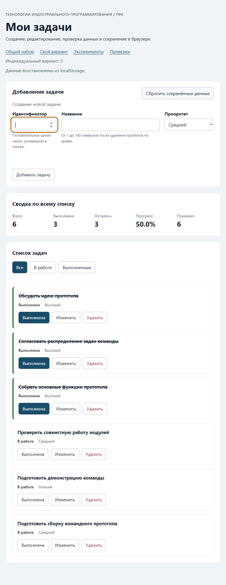

# Практическая работа № 4. Формы, валидация и локальное хранение данных

## Данные работы

| Поле | Значение |
|---|---|
| Имя | Гаврилов Даниил |
| Группа | ЭФБО-05-25 |
| Номер в журнале и вариант из ПР2–ПР3 | N = 5; ((5 − 1) % 8) + 1 = **5** |
| Тематика варианта | Разработка командного прототипа |
| Node.js | v24.11.1 |
| npm | 11.6.2 |
| Git | 2.55.0.windows.5 |
| Браузер | Codex In-app Browser для интерфейса и проверок; отдельная цель отладки — Chromium 148.0.7778.96. Интерфейс DevTools также открыт во встроенном браузере Codex. |
| Операционная система | Windows 11 Домашняя для одного языка, 10.0.26200 |

Методичка: [ПР4 курса TIP-JS](https://github.com/adyshkins/TIP-JS/blob/main/practices/practice-04/README.md).
Используется вложенная заготовка `starter/practice-04`. Предыдущие практики остаются самостоятельными этапами.

## Запуск

Из папки `practice-04`:

```bash
npm test
npm run check:own
npm start
```

Устанавливать зависимости не требуется. В PowerShell при блокировке скрипта npm доступны те же команды через `npm.cmd`.

```text
http://127.0.0.1:5504/
http://127.0.0.1:5504/index.html?dataset=variant
http://127.0.0.1:5504/examples/forms-storage.html
http://127.0.0.1:5504/checks.html
```

Порт 5504 используется во всех браузерных проверках. Другой узел или порт меняет origin и область localStorage.

## Перенос результата ПР3

| Файл | Что перенесено или изменено |
|---|---|
| `data.js` | Общий набор и шесть задач варианта 5 перенесены без изменений из ПР3. |
| `task-service.js` | Перенесены все функции ПР2–ПР3. Добавлен `updateTask`, меняющий только title и priority. Сохраняются id, completed, порядок и входные объекты. |
| `task-selectors.js` | Перенесена чистая выборка all/pending/completed с сохранением порядка. |
| `task-view.js` | Перенесены безопасная отрисовка через textContent, сводка и пустые состояния. В карточку добавлена третья кнопка edit с подписью «Изменить». |

Новый main.js построен на заготовке ПР4. Перенесены отрисовка, делегирование событий и фильтры; добавлены режимы формы и хранение. Регрессия сервиса: **35 из 35**, ошибок 0.

## Эксперименты с формой и хранилищем

Прогнозы зафиксированы до браузерных действий; факты получены в Codex In-app Browser на странице `examples/forms-storage.html`.

| № | До запуска: прогноз | После запуска: результат | Объяснение |
|---:|---|---|---|
| 1. Пустое обязательное поле | Браузер заблокирует submit; журнал не изменится; validity.valid = false. | Журнал остался «Действия ещё не выполнялись.». valid = false, valueMissing = true; сообщение «Заполните это поле.». | HTML required проверяется до события submit. |
| 2. Название из пробелов | required пропустит строку, прикладная проверка установит customValidity. | Submit получен. Выведено «Название не должно состоять только из пробелов.». customError = true, valid = false. | Строка непустая для required, но trim даёт пустое название. |
| 3. Типы значений FormData | preventDefault отменит навигацию; FormData и getItem возвращают строки; название нормализуется. | Для «  Прототип  »/high: defaultPrevented = true, typeof FormData title = string, typeof localStorage value = string; объект содержит title: «Прототип», priority: «high». | Числа и нормализация относятся к прикладной границе, а не FormData. |
| 4. Строка localStorage и JSON | JSON.parse восстановит объект из строки. | Прочитано `{"title":"Прототип","priority":"high"}`; parsed содержит те же title/priority. | Storage хранит строку; JSON.stringify/parse преобразуют представление. |
| 5. Повреждённый JSON | JSON.parse выбросит перехваченное исключение. | Для `{broken-json`: Expected property name or '}' in JSON at position 1 (line 1 column 2). Страница продолжает работать; учебный ключ затем удалён, getItem = null. | try/catch нужен уже для синтаксиса; успешный разбор ещё не подтверждает схему задач. |

## Организация кода

`task-service.js` защищает операции модели без DOM и storage. `form-validation.js` нормализует черновик и возвращает все независимые ошибки полей. `task-storage.js` проверяет весь список, версию оболочки и JSON, перехватывает чтение, запись и удаление. `task-view.js` создаёт DOM через textContent. `main.js` координирует состояние, режим формы, события, сервис, сохранение и отображение.

Storage передаётся аргументом: зависимость видна и модуль проверяется с MemoryStorage или объектом, выбрасывающим исключения. Данные JSON проверяются до использования целиком; неверный completed, повторный id, пробелы в ненормализованном title или другая версия приводят к независимой копии исходного набора. Повреждённая запись не удаляется автоматически.

Основные ключи: `tip-js-practice-04:demo`, `tip-js-practice-04:variant`. Автоматические браузерные проверки используют отдельные `tip-js-practice-04:checks:*`. Фильтры, edit и renderApp не записывают данные. Сохраняются успешные add/update/toggle/delete; reset удаляет только текущий ключ без повторной записи исходного массива. Глобальный `localStorage.clear()` не используется.

## Проверка формы

| Сценарий | Ожидаемый результат | Фактический результат | Итог |
|---|---|---|---|
| Корректное добавление | Создание задачи, сброс формы и сохранение | В общем сценарии добавлен id 20; карточка и сводка обновились; браузерная проверка подтверждает сохранённый JSON и нормализацию | Пройдено |
| Повторяющийся id | Отказ без изменения списка и storage | У id 4 ошибка «Задача с идентификатором 4 уже существует.»; список и сводка совпали с шагом 1. Браузерная проверка подтвердила отсутствие записи при отказе | Пройдено |
| Пустое название | Отказ | Нативное required блокирует submit; журнал эксперимента не изменился; автоматическая проверка приложения также прошла | Пройдено |
| Название из пробелов | Отказ прикладной проверки | Эксперимент показывает customError; браузерная проверка приложения подтвердила aria-invalid и сообщение title | Пройдено |
| Название длиной 100 | Успех | В варианте через Enter добавлен id 101, title из 100 букв «Я», low: 7 / 4 / 3 / 57.1% | Пройдено |
| Название длиной 101 | Отказ | Node validateTaskDraft: ok = false, только errors.title; браузерное maxlength задано 100 | Node: пройдено |
| Изменение title и priority | Меняется одна задача; статус сохраняется | В общем сценарии id 4 получил «Подготовить форму задач»/low и остался «В работе»; в варианте id 23 получил новое название/high и остался выполненным | Пройдено |
| Отмена редактирования | Пустая форма создания, id включён | Официальная браузерная проверка подтвердила пустые id/title, доступный id, скрытую отмену и кнопку «Добавить задачу» | Пройдено |

## Общий сценарий

Все восемь шагов выполнены вручную во встроенном браузере. Ожидания были записаны до запуска; фактические id, значения сводки и сообщение storage прочитаны из интерфейса после каждого действия.

| Шаг | Действие | Фактические видимые id | Ожидание: всего / выполнено / осталось / прогресс | Фактическая сводка | Сообщение storage в интерфейсе |
|---:|---|---|---|---|---|
| 0 | Исходный запуск после сброса | [1, 4, 7, 10] | 4 / 2 / 2 / 50.0% | 4 / 2 / 2 / 50.0% | Используется исходный набор; сохранённые данные удалены. |
| 1 | Добавить 20, «Изучить localStorage», high | [1, 4, 7, 10, 20] | 5 / 2 / 3 / 40.0% | 5 / 2 / 3 / 40.0% | Изменения сохранены в localStorage. |
| 2 | Повторный id = 4 | [1, 4, 7, 10, 20] | 5 / 2 / 3 / 40.0% | 5 / 2 / 3 / 40.0% | Изменения сохранены в localStorage. |
| 3 | Изменить 4: «Подготовить форму задач», low | [1, 4, 7, 10, 20] | 5 / 2 / 3 / 40.0% | 5 / 2 / 3 / 40.0% | Изменения сохранены в localStorage. |
| 4 | Отметить выполненной 7 | [1, 4, 7, 10, 20] | 5 / 3 / 2 / 60.0% | 5 / 3 / 2 / 60.0% | Изменения сохранены в localStorage. |
| 5 | Удалить 1 | [4, 7, 10, 20] | 4 / 2 / 2 / 50.0% | 4 / 2 / 2 / 50.0% | Изменения сохранены в localStorage. |
| 6 | Перезагрузка | [4, 7, 10, 20] | 4 / 2 / 2 / 50.0% | 4 / 2 / 2 / 50.0% | Данные восстановлены из localStorage. |
| 7 | Сброс | [1, 4, 7, 10] | 4 / 2 / 2 / 50.0% | 4 / 2 / 2 / 50.0% | Используется исходный набор; сохранённые данные удалены. |

На шаге 2 около id показана ошибка «Задача с идентификатором 4 уже существует.»; карточки, их поля и сводка не изменились. После редактирования id 4 сохранил невыполненный статус. Перезагрузка восстановила [4, 7, 10, 20] и 50.0%. После сброса вернулись исходные поля и карточки. Таблица приводит сообщения приложения. Отдельная ручная проверка через DevTools/Application, описанная ниже, подтвердила неизменность JSON после отказа и отсутствие ключа после сброса.

## Проверка восстановления и ошибок

| Случай | Ожидание | Фактический результат | Итог |
|---|---|---|---|
| Записи нет | Независимая копия исходного набора, source = initial | Node-проверки 16/27 подтверждают независимость; браузерная проверка запуска подтверждает исходные задачи и отсутствующий тестовый ключ | Пройдено |
| Корректная запись | Данные восстанавливаются после перезагрузки | Вручную перезагружены общий набор и вариант: состав и изменённые поля сохранились; сообщение «Данные восстановлены из localStorage.» | Пройдено |
| Повреждённый JSON | Fallback и предупреждение | Через DevTools/Application в demo-ключ записано {broken-json. После перезагрузки: исходный набор, 4 / 2 / 2 / 50.0%, предупреждение об ошибке чтения; повреждённая строка сохранилась | Пройдено |
| Неверная версия или схема | Исходный набор и предупреждение | Node-проверки 19/20 и браузерная проверка неверного completed подтвердили fallback | Пройдено |
| Недоступное storage | Понятная ошибка, исключение не выходит | Node-проверки 21/24/26 ловят getItem/setItem/removeItem; собственный случай дополнительно проверил throw null и строку | Node: пройдено |
| Сброс | Удаляется только текущий ключ, восстанавливаются исходные данные | Вручную восстановлены исходные demo и variant. После сброса повреждённого demo через Application/Refresh проверено отсутствие tip-js-practice-04:demo; соседний ключ сохраняется в официальной и собственной проверках | Пройдено |
| Общий и индивидуальный наборы | Изменения не смешиваются | После изменений варианта общий набор остался [1, 4, 7, 10], 4 / 2 / 2 / 50.0%; официальный тест двух ключей также прошёл | Пройдено |

## Индивидуальный вариант

Исходные задачи: 11 «Обсудить идею прототипа»; 23 «Распределить задачи в команде»; 37 «Подготовить макет экранов»; 41 «Собрать основные функции прототипа»; 58 «Проверить совместную работу модулей»; 64 «Подготовить демонстрацию команды». Первые четыре выполнены.

В браузере после сброса добавлена задача 75 «Подготовить сборку командного прототипа»/medium; задача 23 изменена на «Согласовать распределение задач команды»/high; задача 37 удалена. При редактировании id 23 поле идентификатора имело disabled = true, value = «23»; completed сохранился true. Перезагрузка вернула все изменения. Переход в общий набор показал исходные четыре задачи и 50.0%; возврат и сброс варианта восстановили исходные шесть задач и 66.7%.

| Этап | Ожидаемые всего / выполнено / осталось / прогресс | Фактическая сводка | Фактические видимые id |
|---|---|---|---|
| Исходный набор после сброса | 6 / 4 / 2 / 66.7% | 6 / 4 / 2 / 66.7% | [11, 23, 37, 41, 58, 64] |
| После добавления 75 | 7 / 4 / 3 / 57.1% | 7 / 4 / 3 / 57.1% | [11, 23, 37, 41, 58, 64, 75] |
| После редактирования 23 | 7 / 4 / 3 / 57.1% | 7 / 4 / 3 / 57.1% | [11, 23, 37, 41, 58, 64, 75] |
| После удаления 37 | 6 / 3 / 3 / 50.0% | 6 / 3 / 3 / 50.0% | [11, 23, 41, 58, 64, 75] |
| После перезагрузки | 6 / 3 / 3 / 50.0% | 6 / 3 / 3 / 50.0% | [11, 23, 41, 58, 64, 75] |
| После сброса | 6 / 4 / 2 / 66.7% | 6 / 4 / 2 / 66.7% | [11, 23, 37, 41, 58, 64] |

Независимая собственная Node-проверка повторяет эту последовательность с другими тематическими названиями, проверяет сохранение completed, восстановление и удаление только variant-ключа. Её итог совпал: 6 / 3 / 3 / 50.0%.

## Протокол проверок сервиса

Фактический вывод `node checks/service.checks.js` (также запускается `npm run check:service`):

```text
OK: 01. Создание задачи с явным приоритетом
OK: 02. Приоритет по умолчанию
OK: 03. Удаление краевых пробелов без изменения внутренних
OK: 04. Граничные длины названия и положительный безопасный id
OK: 05. Некорректные названия при создании
OK: 06. Некорректные идентификаторы при создании
OK: 07. Все допустимые приоритеты и отклонение недопустимых
OK: 08. Каждый вызов createTask возвращает новый объект
OK: 09. Поиск по id, а не по индексу
OK: 10. Отсутствующая задача и пустой массив при поиске
OK: 11. Поиск не преобразует строковый id в число
OK: 12. Получение невыполненных задач
OK: 13. Пустой список, все выполнены и все не выполнены
OK: 14. Названия в исходном порядке и пустой список
OK: 15. Сводка по общему набору
OK: 16. Сводка по пустому списку
OK: 17. Сводка: ничего не выполнено и выполнено всё
OK: 18. Процент остаётся числом без предварительного округления
OK: 19. Добавление в конец без изменения входного массива
OK: 20. Добавление в пустой список с приоритетом по умолчанию
OK: 21. Повторяющийся id отклоняется
OK: 22. Добавление не обходит проверки createTask
OK: 23. Изменение completed в обе стороны
OK: 24. completed принимает только boolean
OK: 25. Некорректный или отсутствующий id при изменении статуса
OK: 26. Повторная установка статуса создаёт новый результат
OK: 27. Переименование сохраняет остальные поля
OK: 28. Проверки названия при переименовании
OK: 29. Некорректный или отсутствующий id при переименовании
OK: 30. Удаление по id с сохранением порядка
OK: 31. Удаление единственной записи
OK: 32. Некорректный, отсутствующий id и удаление из пустого списка
OK: 33. Входные объекты не изменяются ни одной операцией
OK: 34. Общий сценарий и все промежуточные сводки
OK: 35. Работа с другим набором, без зависимости от demoTasks

Проверок пройдено: 35; не пройдено: 0.
```

## Протокол проверок новых модулей

Фактический вывод `node checks/modules.checks.js` (также запускается `npm run check:modules`):

```text
OK: 01. updateTask изменяет название и приоритет выбранной задачи
OK: 02. updateTask нормализует название и сохраняет completed
OK: 03. updateTask не изменяет входной массив и объекты
OK: 04. updateTask отклоняет некорректный и отсутствующий id
OK: 05. updateTask отклоняет некорректные название и приоритет
OK: 06. Валидация создания нормализует поля
OK: 07. Валидация отклоняет некорректные id
OK: 08. Валидация отклоняет повторяющийся id при создании
OK: 09. Валидация проверяет название после trim
OK: 10. Валидация принимает только три приоритета
OK: 11. В режиме редактирования используется editingId
OK: 12. Редактирование отсутствующей задачи отклоняется
OK: 13. Валидация не изменяет draft и список
OK: 14. Проверка схемы принимает корректный список
OK: 15. Проверка схемы отклоняет неверную структуру
OK: 16. Отсутствующая запись возвращает независимую копию исходных данных
OK: 17. Корректная запись восстанавливается из хранилища
OK: 18. Повреждённый JSON приводит к безопасному fallback
OK: 19. Неизвестная версия приводит к безопасному fallback
OK: 20. Некорректные задачи из JSON не принимаются
OK: 21. Ошибка getItem перехватывается
OK: 22. Сохранение записывает версию и задачи
OK: 23. Некорректный список не записывается
OK: 24. Ошибка setItem перехватывается
OK: 25. Удаляется только переданный ключ
OK: 26. Ошибка removeItem перехватывается
OK: 27. Результат загрузки не разделяет объекты с fallback

Проверок пройдено: 27; не пройдено: 0.
```

## Протокол браузерных проверок

Фактический текст блока «Текстовый протокол» с checks.html, полученный во встроенном браузере:

Сводка страницы: **всего 23, пройдено 23, ошибок 0**.

```text
OK: Фильтры ПР3 сохраняют порядок и не изменяют вход
OK: Карточка содержит toggle, edit и delete
OK: Название задачи выводится как текст
OK: Повторная отрисовка списка не накапливает карточки
OK: Сводка использует полный список и отдельный visibleCount
OK: Пустые состояния различают список и фильтр
OK: Приложение запускается с исходным набором
OK: Корректная форма добавляет задачу и сохраняет данные
OK: Повторяющийся id отклоняется без записи
OK: Название из пробелов отклоняется прикладной проверкой
OK: Нативные ограничения не пропускают пустую форму
OK: Кнопка edit заполняет форму и блокирует id
OK: Редактирование меняет title и priority, сохраняя completed
OK: Отмена редактирования возвращает режим создания
OK: Успешная отправка очищает ошибки и форму
OK: Изменение статуса сохраняется
OK: Удаление сохраняется
OK: Фильтр не записывается, но сохраняется после изменения данных
OK: Перезагрузка восстанавливает сохранённые задачи
OK: Сброс удаляет ключ и восстанавливает исходный набор
OK: Повреждённый JSON не ломает запуск
OK: Некорректная схема из storage заменяется исходным набором
OK: Общий и индивидуальный наборы используют разные ключи
```

## Собственные проверки

Дополнительные проверки модулей запускаются `npm run check:own`; файл `checks/own.checks.js`. Это не дополнительное функциональное задание и не замена ручным браузерным сценариям.

| № | Исходное состояние и действия | Ожидаемый результат | Фактический результат | Итог |
|---:|---|---|---|---|
| 1 | Черновик с новым id 75: названия длиной 100 и 101 | 100 принимается; 101 отклоняется | ok = true / false; у отказа только errors.title | Пройдено |
| 2 | id 4, пробелы в title, priority urgent | Все независимые ошибки возвращаются вместе | errors содержит id, title, priority | Пройдено |
| 3 | updateTask без priority | Отказ, массив не изменяется | ok = false; JSON исходного набора совпал | Пройдено |
| 4 | Сохранить [], заново прочитать с непустым fallback | Пустой массив считается сохранёнными данными | source = storage, tasks = [] | Пройдено |
| 5 | JSON с title «  Название  » | Отклонить весь список; сохранить запись для исследования | fallback равен исходному набору; raw не изменился | Пройдено |
| 6 | storage выбрасывает null/строку при get/set/remove | Все исключения перехвачены | Три ok = false с непустыми error | Пройдено |
| 7 | Вариант 5: добавить75, изменить23, удалить37; сохранить/прочитать; отдельный сброс | 6 / 3 / 3 / 50%; demo остаётся независимым | Ожидания совпали; завершены чтение, удаление и возврат исходных задач | Пройдено |

```text
Собственных проверок пройдено: 7; не пройдено: 0.
```

Собственные ручные браузерные случаи:

| № | Исходное состояние и действия | Ожидаемый результат | Фактический результат | Итог |
|---:|---|---|---|---|
| 1 | Сброшен вариант 5; введены id 101, title из 100 букв «Я», low; отправка клавишей Enter из поля названия | Создать одну невыполненную задачу на границе длины, без перехода страницы | Появилась карточка 101 с 100 символами; [11, 23, 37, 41, 58, 64, 101], 7 / 4 / 3 / 57.1%; сообщение о сохранении | Пройдено |
| 2 | Перезагрузить страницу после случая 1 | Сохранить все 100 символов и остальные данные | Карточка 101 и её название сохранились; 7 / 4 / 3 / 57.1%; сообщение о восстановлении из localStorage | Пройдено |
| 3 | В Application изменить значение tip-js-practice-04:demo на {broken-json; перезагрузить страницу; проверить значение и выполнить сброс | Исходный набор и предупреждение; повреждённая запись остаётся до сброса, затем ключ удаляется | 4 / 2 / 2 / 50.0%, предупреждение «Не удалось прочитать сохранённые задачи. Используется исходный набор.» и ошибка JSON; исходная {broken-json сохранилась. После сброса Application/Refresh показал отсутствие ключа | Пройдено |

## Отладка и клавиатура

Отладка выполнена на отдельной цели Chromium 148.0.7778.96, с интерфейсом DevTools во встроенном браузере справа. В `handleFormSubmit` файла `src/main.js` установлены точки останова на строках 174, 175 и 184. Форма отправлялась клавишей Enter; в Scope наблюдалось `SubmitEvent.isTrusted = true`.

| Остановка | Ожидаемое значение | Фактически в Scope |
|---|---|---|
| 174, перед validateTaskDraft | Сырые поля FormData ещё строковые | `draft = { id: "20", title: " Отладка формы ", priority: "medium" }` |
| 175, после validateTaskDraft | Числовой id и нормализованное название | `validated = { ok: true, value: { id: 20, title: "Отладка формы", priority: "medium" } }` |
| 184, после addTask | Успех сервиса, новый массив с одной добавленной задачей | `result = { ok: true, tasks: Array(5) }`, `isEditing = false`; id 20, title «Отладка формы», priority medium |

После Resume через Application → Local Storage прочитано значение ключа `tip-js-practice-04:demo`. Фактическая строка:

```json
{"version":1,"tasks":[{"id":1,"title":"Изучить функции","completed":true,"priority":"medium"},{"id":4,"title":"Подготовить модель задач","completed":false,"priority":"high"},{"id":7,"title":"Проверить методы массивов","completed":false,"priority":"low"},{"id":10,"title":"Оформить README","completed":true,"priority":"medium"},{"id":20,"title":"Отладка формы","completed":false,"priority":"medium"}]}
```

Отдельно проверен повторный id. Сырой `draft = { id: "4", title: "Повторный id", priority: "medium" }`. На строке 175: `validated.ok = false`, `validated.errors.id = "Задача с идентификатором 4 уже существует."`. Поля id/title/priority и result, объявляемые после ветки отказа, ещё недоступны отладчику. После Resume появился отказ около поля; повторное чтение Application подтвердило, что JSON побайтово совпадает с прежней строкой. Сервисная операция и сохранение после отказа не выполнялись.

Все три точки останова затем отключены. В Application значение demo-ключа заменено на `{broken-json`; обычная перезагрузка показала исходные четыре задачи и предупреждение, а повторное чтение подтвердило, что повреждённая запись не удалена и не перезаписана автоматически. После кнопки сброса и Refresh в Application ключ отсутствовал.

Клавиатура проверена отдельно в основном интерфейсе IAB: после загрузки варианта фокус находился на `#task-id`; следующий Tab перевёл его в `#task-title`. Отправка Enter из названия добавила задачу с title длиной 100, без перехода страницы. В фильтре «В работе» исходно отображались [58, 64]; Space на toggle задачи 58 оставил видимой [64], сводка стала 6 / 5 / 1 / 83.3%, а фокус перешёл на активную кнопку фильтра «В работе», поскольку карточка исчезла. Изменения сохранились; сброс вернул 6 / 4 / 2 / 66.7%.

При начале редактирования задачи 23 фактический `activeElement` — input `#task-title`, поле id заблокировано и содержит 23. После нажатия «Отменить редактирование» `activeElement` — input `#task-id`, форма вернулась в режим создания.

## Вид приложения



Фактический снимок приложения во встроенном браузере после добавления 75, редактирования 23, удаления 37 и перезагрузки: 6 задач, выполнено 3, осталось 3, прогресс 50.0%; сообщение о восстановлении из localStorage.

## Дополнительное задание

Не выполнено. Реализована обязательная часть без черновика формы и синхронизации вкладок.

## Вывод

Реализованы чистая проверка черновика, неизменяющее вход обновление задачи и хранение с проверкой версии и полной схемы. Нативные ограничения HTML отсекают пустой и структурно неверный ввод; прикладная валидация защищает уникальность id и нормализованное название; проверка JSON защищает уже сохранённую модель. Операции не изменяют исходные наборы, фильтры не сохраняются, а повреждённое или недоступное storage приводит к управляемому результату.
